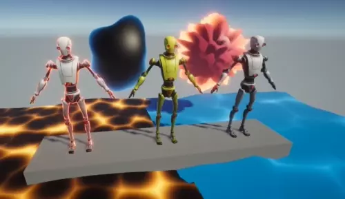

# Shader Graph in Universal Render Pipeline

This project implements toy shaders by following and extending on the ideas of the "Shader Graph for Beginners" course of Zenva's [Unity Game Development Mini-Degree](https://academy.zenva.com/product/unity-game-development-mini-degree/).

This project uses Shader Graph to explore color and vertex modification through shaders,
including

- tinting textures,
- adding glow by overlaying a Fresnel effect,
- dissolving objects, and
- simulating liquids with Voronoi noise and displacement.

